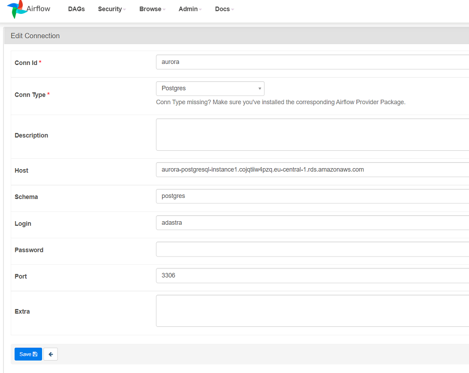

## Setting up Airflow

**Variables and connections**

When you spin up a new Airflow (MWAA) instance, you need to set the following variables and connections in Airflow GUI.

|  Type | Name | Value | Description |
|---|---|---|---|
| Variable | emails | robert.polakovic@adastragrp.com, example@example.com  | Recipients of Airflow's email notifications |
| Connection | AWS Aurora PostgreSQL | Picture below | Main datawarehouse schema. |

**1. Emails definition**

Emails variable represents the list of email addresses notified when process success or failure. It is a simple, comma separated, list of email addresses.

**2. Aurora connection definition**

In Airflow go to Admin -> Connections -> Add a new connection 

Get the Aurora connection string from AWS RDS -> DB instances -> aurora writer instance -> endpoint

New connection has to be of "Postgres" type, it has to be called **aurora**.

**3. DAGs**

Dags definitions can be found [here](../data_platform/airflow/dags/).

Dags python files getting automatically uploaded into S3 bucket (s3://adastracz-demo-airflow/dags/) by GitHub worklfow using this [script](../data_platform/airflow/aws_ci_dags.sh).
