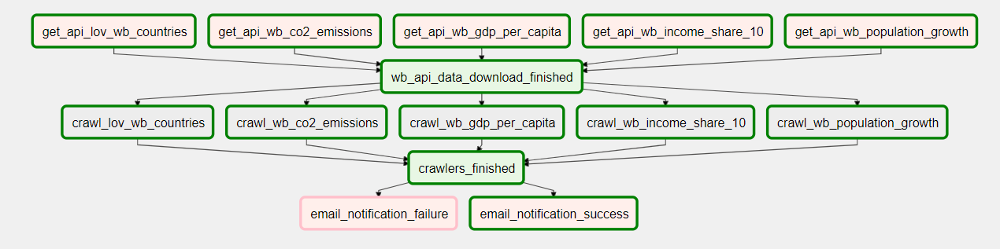
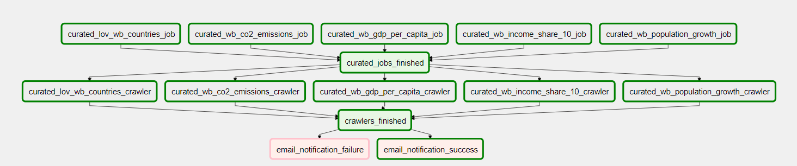
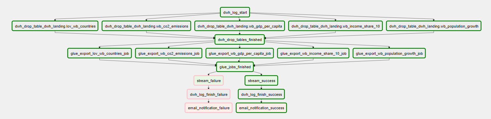
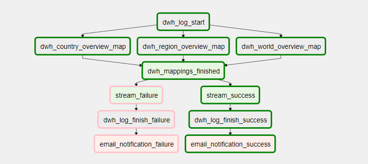

# Airflow process flow

There are currently 4 DAGs implemented in Airflow:

|  DAG | Logic |
|---|---|
| `data_lake_ingest`  | Downloads data from an external API (World Bank data), stores data on S3 and starts Glue crawlers to create tables on top of the data in `data_lake_row` schema in Glue Data Catalog. | 
| `data_lake_process` | Gets the data from `data_lake_row`, transformes and cleans it and saves it on S3. Starts crawlers to create new partitions in `data_lake_curated`.  | 
| `data_lake_export`  | Exports data from `data_lake_curated` to AWS Aurora PostgreSQL using JDBC. | 
| `dwh_process`  | Main DWH process - it loads and transformes data from Aurora's `dwh_landing` schema to `dwh_master`. | 


## Details

**data_lake_ingest - [code](../data_platform/airflow/dags/data_lake_ingest.py)**



1. first we download the following datasets form an external API and store the data on S3

```
- GDP per capita, PPP (current international $) (https://api.worldbank.org/v2/country/all/indicator/NY.GDP.PCAP.PP.CD?date=2013&per_page=400&format=json)
- Income share held by highest 10% (https://api.worldbank.org/v2/country/all/indicator/SI.DST.10TH.10?date=2019&per_page=400&format=json)
- Population growth (annual %) (https://api.worldbank.org/v2/country/all/indicator/SP.POP.GROW?date=2016&per_page=400&format=json)
- CO2 emissions (kiloton) (https://api.worldbank.org/v2/country/all/indicator/EN.ATM.CO2E.KT?date=2019&per_page=400&format=json)
- LOV countries overview (https://api.worldbank.org/v2/country?format=json&per_page=400&page=1)
```

2. start Glue crawlers to create new tables/partitions using `AwsGlueCrawlerOperator`

```
crawl_data = AwsGlueCrawlerOperator(
    task_id='crawl_' + wb_datasets[wb_set]['name'],
    config = {"Name": wb_datasets[wb_set]['glue_crawler']},
    dag=dag
)
```

3. notify email addresses defined in the `emails` Airflow variable that the process has successfully finished (failed)

```
client = boto3.client('ses',region_name=REGION_NAME)
...
response = client.send_templated_email(
```

```
email_notif_task = PythonOperator(
    task_id='email_notification_' + notif_type,
    provide_context=True,
    python_callable=lambda dag_name=DAG_NAME, type=notif_type, **kwargs: send_email(dag_name, type, **kwargs),
    dag=dag
)
```

**data_lake_process - [code](../data_platform/airflow/dags/data_lake_process.py)**



1. First it starts Glue Jobs to move the data from `data_lake_row` to `data_lake_curated`. Glue jobs are defined in Terraform template, scripts can be found [here](../data_platform/data_lake/glue_jobs/curated/)

```
curated_glue_job_task = AwsGlueJobOperator(
                task_id = job_name + '_job',
                job_name = job_name,
                region_name = REGION_NAME,
                num_of_dpus = 1,
                dag = dag
)
```

2. Glue Crawlers are started to create new partitions in `data_lake_curated`. Again, crawlers are defined in Terraform templates [here](../data_platform/data_lake/crawlers/)

```
curated_crawler_task = AwsGlueCrawlerOperator(
                task_id=cralwer_name + '_crawler',
                config = {"Name": cralwer_name},
                dag=dag
)
```

3. notification emails are sent (same as in the previous job)


**data_lake_export - [code](../data_platform/airflow/dags/data_lake_export.py)**



1. We log a `start` event into the Aurora database (logs table) by calling a stored procedure. We do this using Airflow's `PostgresOperator` operator.

```
dwh_log_start = PostgresOperator(
    task_id="dwh_log_start",
    postgres_conn_id="aurora",
    sql="call dwh_adm.log_event('%s','%s','%s','%s', null, null);" % ('start', 'Airflow', DAG_NAME, '{{ run_id }}'),
    autocommit = True
)
```

2. We drop tables in Aurora's `dwh_landing` schema - this needs to be done before we load new data in.

```
sql_command = "call dwh_adm.drop_table('%s');" % (datasets[dataset]['dwh_table'])
truncate_task = PostgresOperator(
    task_id="dwh_drop_table_" + datasets[dataset]['dwh_table'],
    postgres_conn_id="aurora",
    sql=sql_command
)
```

3. Starting Glue jobs that export data from `Data Lake` to `Aurora`. Jobs use JDBC to connect from Glue to Aurora's PostgreSQL database.

```
datasink4 = glueContext.write_dynamic_frame.from_jdbc_conf(
    frame=my_dyf,
    catalog_connection='aurora',
    connection_options={"dbtable": 'dwh_landing.wb_co2_emissions', "database": "postgres"},
    transformation_ctx="datasink4"
)
```

4. We log a `finish` event to Aurora's log table.
5. Send a notification email.

**dwh_process - [code](../data_platform/airflow/dags/dwh_process.py)**



1. We log a `start` event into the Aurora logs table.
2. Start `mappings` to load the data from Aurora's `dwh_landing` to `dwh_master` schema. Mappings are implemented as PostgreSQL stored procedures.

```
dwh_country_overview_map = PostgresOperator(
    task_id="dwh_country_overview_map",
    postgres_conn_id="aurora",
    sql="call dwh_master.country_overview_map();",
    autocommit = True
)
```

3. log `finish` event to Aurora's log table
4. send a notification email