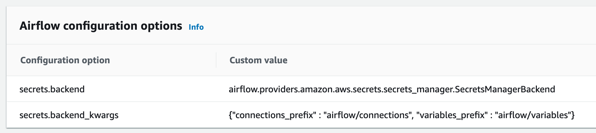

# TODO 

## Airflow - using AWS Secrets Manager for storing variables, connections

Airflow (AWS MWAA) can use AWS Secrets Manager for storing variables and connections. This means that variables and connections can be creating dynamically when spinning up MWAA server and they can be parametrized.

More details:

https://docs.aws.amazon.com/mwaa/latest/userguide/connections-secrets-manager.html

For setting up AWS Secret Manager as an Airflow backend you need to set up the following Airflow Configuration options:

