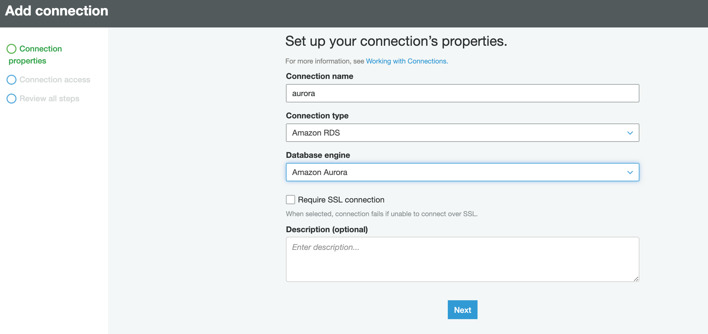
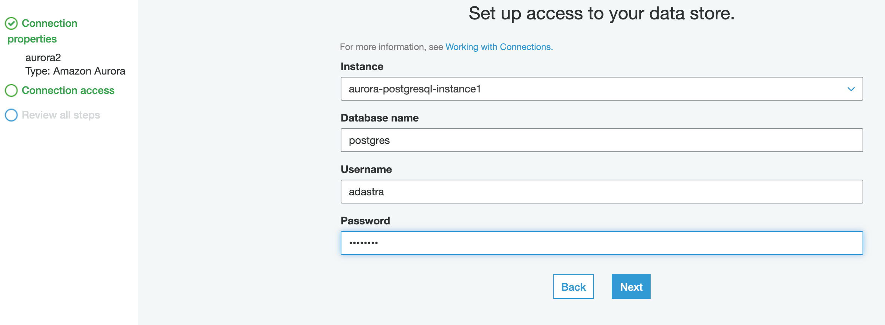
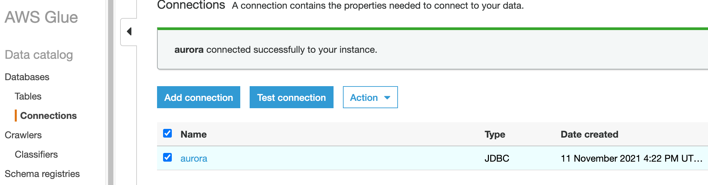
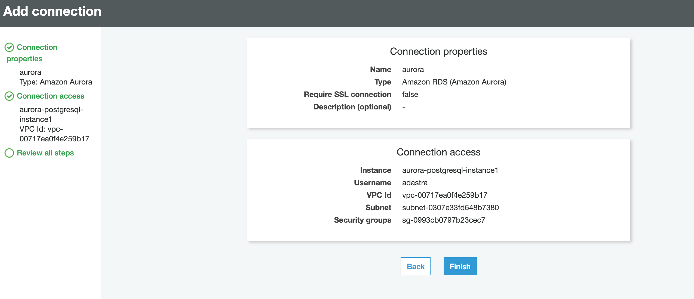
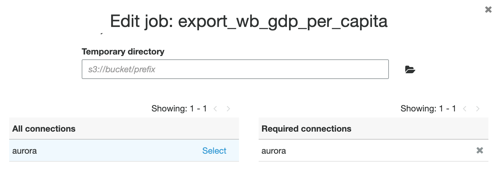

# Integrating Aurora with Glue

Glue (Glue jobs) needs to be integrated with Aurora so it can load the data into Aurora using JDBC

1. Create a new connection in Glue

Go `Glue -> Connections -> Add connection`. Test the connection afterwards.

1. Update every Glue (Spark) job loading data to Aurora (if necessary... This connection is defined in the Terraform job definition but it needs to be fixed with every job update)

Go `Edit Job -> scroll down -> add the aurora connection` (you have craeted in the previous step). Unfortunatelly this has to be done manually as the connection is not known during runtime (I want to fix this later).

  
