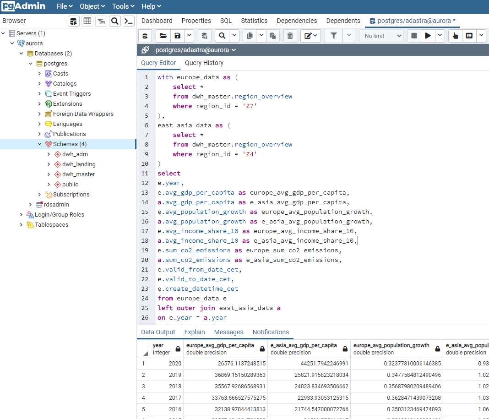

# Aurora process flow

There are currently 3 schemas in the Aurora's database:

- `dwh_landing` - landing schema for Data Lake data
- `dwh_master` - main DWH schema (transformed data)
- `dwh_adm` - technical schema (logs)

## dwh_landing

Tables in the landing schema get created automatically by the Glue jobs. The tables available:

``` sql
- dwh_landing.wb_income_share_10
- dwh_landing.wb_co2_emissions
- dwh_landing.wb_population_growth
- dwh_landing.wb_gdp_per_capita
- dwh_landing.lov_wb_countries
```

At the bagining of the Airflow data lake export process:

1. Airflow drops all the tables in the `dwh_landing`
2. Glue creates new tables with the same names 

## dwh_master

There are currently 3 tables available in `dwh_master`:

``` sql
- dwh_master.country_overview
- dwh_master.region_overview
- dwh_master.world_overview
```

These tables contain data from `dwh_landing` transformed and aggregated on country, region and world level.

`dwh_master` tables get populated by Aurora's stored procedures (mappings) called by Airflow:
 
``` sql
create or replace procedure dwh_master.region_overview_map()
language plpgsql    
as $$
begin
--
    CALL dwh_adm.log_event('Start', 'postgres', null, 'dwh_master.region_overview_map', null);
    --
    TRUNCATE TABLE dwh_master.region_overview;

    INSERT INTO dwh_master.region_overview
        with process_dates as (
            select 
                to_date('01.01.' || extract(year from current_date) - generate_series, 'DD.MM.YYYY')  as process_date,
                extract(year from current_date) - generate_series as year
            from generate_series(0, 50)
        ),
        data as (
        select 
            lov.region_iso_2_code as region_id,
            lov.region_name as region_name,
            gdp.val as gdp_per_capita,
            pop.val as population_growth,
            inc.val as income_share_10,
            co.val as co2_emissions,
            years.year,
            years.process_date as valid_from_date_cet,
            to_date('31.12.' || years.year, 'DD.MM.YYYY') as valid_to_date_cet,
            CURRENT_TIMESTAMP AT TIME ZONE 'CET' as create_datetime_cet
        from dwh_landing.lov_wb_countries lov
        cross join process_dates years
        left outer join dwh_landing.wb_gdp_per_capita gdp
        on lov.country_iso_3_code = gdp.country_iso_3_code
        and years.process_date between gdp.valid_from_date_cet and gdp.valid_to_date_cet
        left outer join dwh_landing.wb_co2_emissions co
        on lov.country_iso_3_code = co.country_iso_3_code
        and years.process_date between co.valid_from_date_cet and co.valid_to_date_cet
        left outer join dwh_landing.wb_population_growth pop
        on lov.country_iso_3_code = pop.country_iso_3_code
        and years.process_date between pop.valid_from_date_cet and pop.valid_to_date_cet
        left outer join dwh_landing.wb_income_share_10 inc
        on lov.country_iso_3_code = inc.country_iso_3_code
        and years.process_date between inc.valid_from_date_cet and inc.valid_to_date_cet
        )
        select 
			region_id,
			region_name,
			avg(gdp_per_capita) as avg_gdp_per_capita,
			avg(population_growth) as avg_population_growth,
			avg(income_share_10) as avg_income_share_10,
			sum(co2_emissions) as sum_co2_emissions,
			year,
			valid_from_date_cet,
			valid_to_date_cet,
			create_datetime_cet
        from data 
        where (gdp_per_capita is not null
        or population_growth is not null
        or income_share_10 is not null
        or co2_emissions is not null)
        -- no aggregate region
        and region_id != 'NA'
		group by region_id, region_name, year, valid_from_date_cet, valid_to_date_cet, create_datetime_cet;
    --
    CALL dwh_adm.log_event('Finish', 'postgres', null, 'dwh_master.region_overview_map', null);
--
end;$$
```

## dwh_adm

Technical schema for logs and other code. There is currently only 1 log table:

```
- dwh_adm.logs
```

And 2 procedures used by Airflow:

```
- dwh_adm.drop_table - drops a specified table (used for dropping dwh_landing tables)
- dwh_adm.log_event - creates a new record in the log table
```

## Useful selects

Some useful [selects](../data_platform/aurora/selects/)

``` sql
-------------
-------- logs
select *
from dwh_adm.logs
order by create_datetime_cet desc;

-------------
-- Czech Rep. overview
select *
from dwh_master.country_overview
where country_id = 'CZE'
order by valid_to_date_cet desc;

-------------
-- Europe's data
select *
from dwh_master.region_overview
where region_id = 'Z7'
order by year desc;

-------------
-- comparing Europe and "East Asia & Pacific"
with europe_data as (
	select *
	from dwh_master.region_overview
	where region_id = 'Z7'
),
east_asia_data as (
	select *
	from dwh_master.region_overview
	where region_id = 'Z4'
)
select 
e.year,
e.avg_gdp_per_capita as europe_avg_gdp_per_capita,
a.avg_gdp_per_capita as e_asia_avg_gdp_per_capita,
e.avg_population_growth as europe_avg_population_growth,
a.avg_population_growth as e_asia_avg_population_growth,
e.avg_income_share_10 as europe_avg_income_share_10,
a.avg_income_share_10 as e_asia_avg_income_share_10,
e.sum_co2_emissions as europe_sum_co2_emissions,
a.sum_co2_emissions as e_asia_sum_co2_emissions,
e.valid_from_date_cet,
e.valid_to_date_cet,
e.create_datetime_cet
from europe_data e
left outer join east_asia_data a
on e.year = a.year
order by year desc;

-------------
-- world's data
select *
from dwh_master.world_overview
order by year desc;

-------------
-- list of countries, regions
select distinct country_name, region_name, region_code
from dwh_master.country_overview
order by region_name
```


