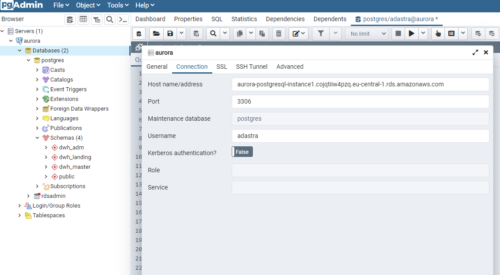

# How to log in to AWS Aurora using pgAdmin

So as to login to you Aurora PostgreSQL database with pgAdmin you need to follow these steps:

- create Aurora PostgreSQL in a private subnet (done automatically when creating Aurora's CloudFormation stack!)
- generate a certificate 
- establish VPN connection to your AWS private subnet (using AWS Client VPN)
- add a security group inbound rule 

https://aws.amazon.com/blogs/database/accessing-an-amazon-rds-instance-remotely-using-aws-client-vpn/

## Detailed steps (using AWS CLI)

Note: these steps can also be done in AWS Management Console!

**1. get your certificate**

How to generate your certificate and upload your certificate to AWS ACM: https://docs.aws.amazon.com/vpn/latest/clientvpn-admin/client-authentication.html#mutual

**2. run create-client-vpn-endpoint**

```
aws ec2 create-client-vpn-endpoint --client-cidr-block "192.168.128.0/22" --server-certificate-arn "arn:aws:acm:xxxxxxxxxx" --authentication-options "Type=certificate-authentication, MutualAuthentication={ClientRootCertificateChainArn=arn:aws:acm:xxxxxxxxx}" --vpc-id "vpc-xxxxxxxxx" --connection-log-options "{\"Enabled\": false}" --split-tunnel --security-group-ids "sg-xxxxxxxxxx"
```

Change the AWS CLI command above:

- change `vpc-xxxxxxxxx`: get your VPC id from RDS (Aurora) details (AWS RDS -> DB Instances -> Writer details)
- change `sg-xxxxxxxxxx`: get your security group id from RDS (Aurora) details (AWS RDS -> DB Instances -> Writer details)
- change certificates information -> get your certificates ARNs from AWS ACM

**3. associate client VPN with target network**

```
aws ec2 associate-client-vpn-target-network --client-vpn-endpoint-id "cvpn-endpoint-xxxxxxxxx" --subnet-id "subnet-xxxxxxxxx"

aws ec2 associate-client-vpn-target-network --client-vpn-endpoint-id "cvpn-endpoint-xxxxxxxxx" --subnet-id "subnet-xxxxxxxxx"
```

- change `cvpn-endpoint-xxxxxxxxx`: get your Client VPN Endpoint ID from AWS VPC service -> Client VPN Endpoints (will be the same for both lines)
- change `subnet-xxxxxxxxx`: get subnets ids from RDS details (AWS RDS -> DB Instances -> Writer details)

**4. authorize client ingress**

```
aws ec2 authorize-client-vpn-ingress --client-vpn-endpoint-id "cvpn-endpoint-xxxxxxx" --target-network-cidr "172.32.0.0/16" --authorize-all-groups
```

- again, change `cvpn-endpoint-xxxxxxx`. Same as above
- `target-network-cidr 172.32.0.0/16` has to match the CloudFormation template (data_platform/infrastructure/env/cloudformation/network.yml: VpcCIDR parameter)

**5.Export the VPN config file and modify it**

Export configuration for OpenVPN client

```
aws ec2 export-client-vpn-client-configuration --client-vpn-endpoint-id "cvpn-endpoint-xxxxxxxxxxxx" --output text > myclientconfig.ovpn
```

This command will export a VPN config file that has to be imported into OpenVPN. Before importing the file to OpenVPN you need to change the file and add 2 lines (below) at the end:


```
cert /path/client1.domain.tld.crt
key /path/client1.domain.tld.key
```

**6. Log in**

Log in to Aurora with pgAdmin using the RDS connection string. Details: https://docs.aws.amazon.com/AmazonRDS/latest/UserGuide/USER_ConnectToPostgreSQLInstance.html#USER_ConnectToPostgreSQLInstance.pgAdmin

**username and password**
Username and passowrd has been set by user during CloudFormation stack creation.

