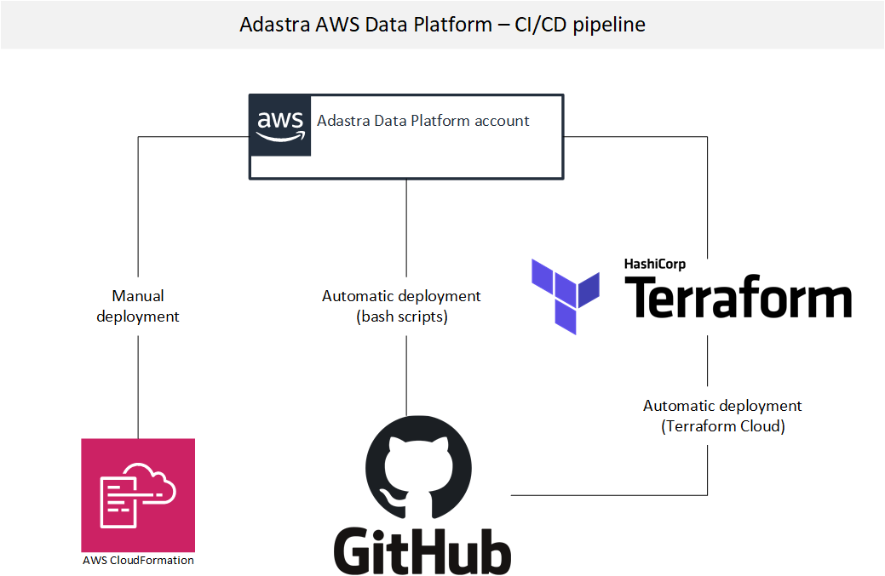
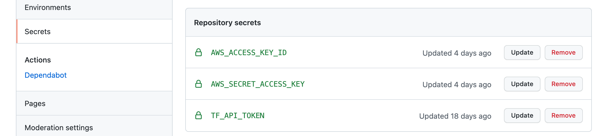

# CI/CD pipeline

CI/CD pipeline has been implemented using GitHub workflows, Terraform Cloud and CloudFormation (manual deployment).

All the GitHub workflow code (usually bash scripts) and Terraform code get deployed automatically on every Git commit. 4 CloudFormation stacks have to be deployed manually when setting up Data Platform for the first time.

## Tools

**GitHub workflow**

Please checkout the GitHub workflow CI [script](../.github/workflows/ci.yml). This is the main workflow driving all the deployment actions. In this workflow we either:

- deploy Terraform scripts using GitHub's Terraform plugin (https://github.com/hashicorp/setup-terraform). 
- deploy (copy) files on AWS S3 using shall scripts ( [example](../data_platform/data_lake/glue_jobs/aws_ci_glue_jobs.sh) )

**GitHub - setting up access to AWS**

To allow GitHub access AWS you need to generate an Access Key in AWS IAM (for the DataPlatformAdmin user or a different user you want to use). Then you need to add the generated (Access Key + Secret Access Key) to `GitHub -> Settings -> Secrets -> Repository Secrets` as `AWS_ACCESS_KEY_ID`  and `AWS_SECRET_ACCESS_KEY` .

**Terraform Cloud**

Terraform Cloud (https://www.terraform.io/cloud) is a free service you can use for storing your Terraform states. This can be useful when building a cloud infrastructure as it makes the whole process way more easier and you can skip storing the states on S3 etc.

All you need to do is to create a token in Terraform Cloud and store it as a `TF_API_TOKEN` in GitHub secrets.

## Workflow

Part of the infrastructure scripts is implement in Terraform, the rest in CloudFormation. In the future we want to switch everything to CloudFormation(TODO).

- CloudFormation scripts have to be deployed manually in AWS (CloudFormation -> stacks) (This includes iam, network, aurora, airflow setup).
- Terraform scripts get deployed automatically using GitHub workflow (deployment gets triggered by every commit).

## Repository overview

All the Data Platform code is stored in `data_platform` directory.

|  Repo directory  | Description |
|---|---|
| [GitHub CI workflow](../.github/workflows/) | main CI/CD workflow |
| [VS Code settings](../.vscode/) | VSCode settings - ignore if you dont use VSCode |
| [All Data Platform code](../data_platform/) | All the Data Platform code|
| [Airflow DAGs definitions](../data_platform/airflow/dags/) | |
| [Aurora SQL code](../data_platform/aurora/) | All the Aurora SQL code - schemas, tables, procedures etc. |
| [All Data Lake code](../data_platform/data_lake/) | all the data lake code - this include Glue jobs, crawlers, Terraform definitions. |
| [Data Lake crawlers](../data_platform/data_lake/crawlers/terraform/) | Glue crawlers Terraform definitions. Any changes in Terraform are automatically deployed. |
| [Data Lake job scripts](../data_platform/data_lake/glue_jobs/scripts/) | Glue jobs scripts. Spark engine python code. |
| [Data Lake job definitions](../data_platform/data_lake/glue_jobs/terraform/) | Glue jobs Terraform definitions. Any changes in Terraform are automatically deployed. |
| [Data Lake infrastructure code](../data_platform/infrastructure/) | Infrastrucutre code - some parts are CloudFormation, the rest is Terraform. Terraform code gets deployed automatically. CloudFormation scripts have to be created manually in AWS CloudFormation stacks. |
| [docs](../docs/) | |

