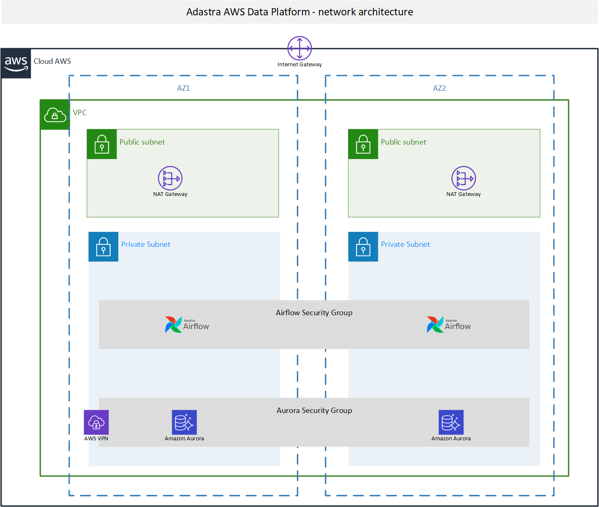

# Adastra Data Platform Overview

## Tech stack

|  Tool/Tech | Description | URL |
|---|---|---|
| GitHub  | CI workflow, version control  | https://github.com/ |
| AWS CloudFormation | Infrastructure code | https://aws.amazon.com/cloudformation/ |
| Terraform (Terraform Cloud) | Infrastructure code | https://www.terraform.io/ |
| Apache Airflow (AWS MWAA) | workflow orchestration | https://airflow.apache.org/ and  https://aws.amazon.com/managed-workflows-for-apache-airflow/ |
| AWS Glue | Data Lake ETLs, metadata catalog | https://aws.amazon.com/glue/ |
| AWS Aurora (PostgreSQL) | EDWH | https://aws.amazon.com/rds/aurora/ |
| AWS Athena | SQL Query engine for adhoc analysis | https://aws.amazon.com/athena/ |
| AWS S3 | Cloud storage  | https://aws.amazon.com/s3/ |
| AWS VPC | network infrastructure | https://aws.amazon.com/vpc/ |
| AWS IAM | identify and access management  | https://aws.amazon.com/iam/ |

# Adastra Data Platform - high level overview

# Adastra Data Platform - data flow

# Adastra Data Platform - network and security architecture

